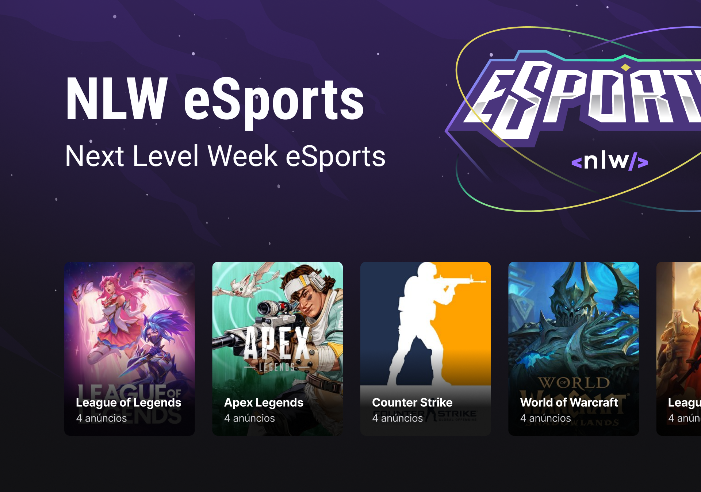
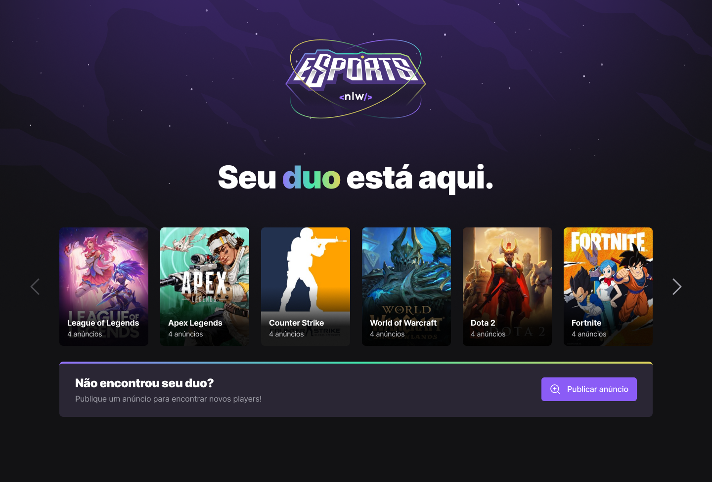
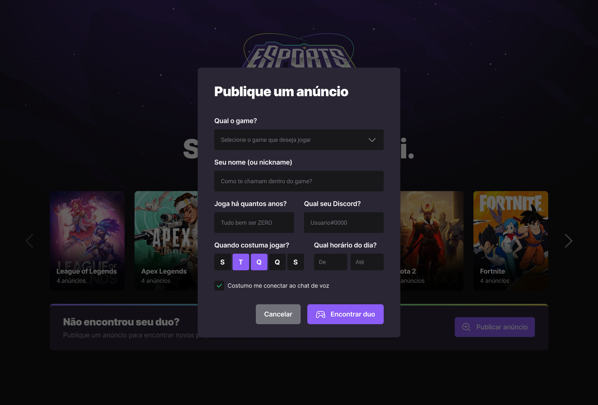
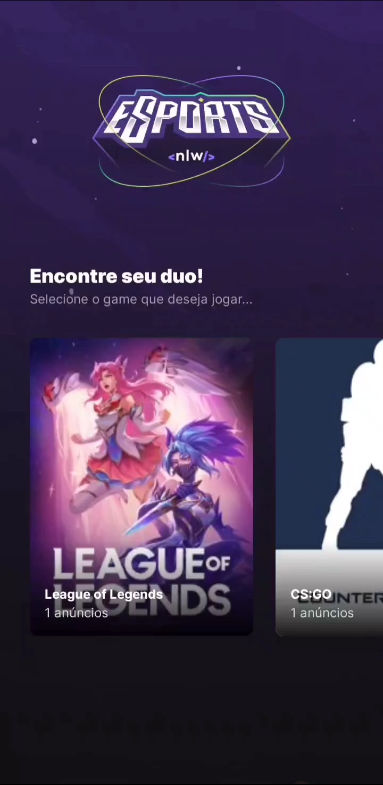
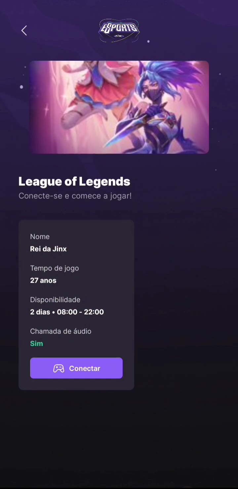
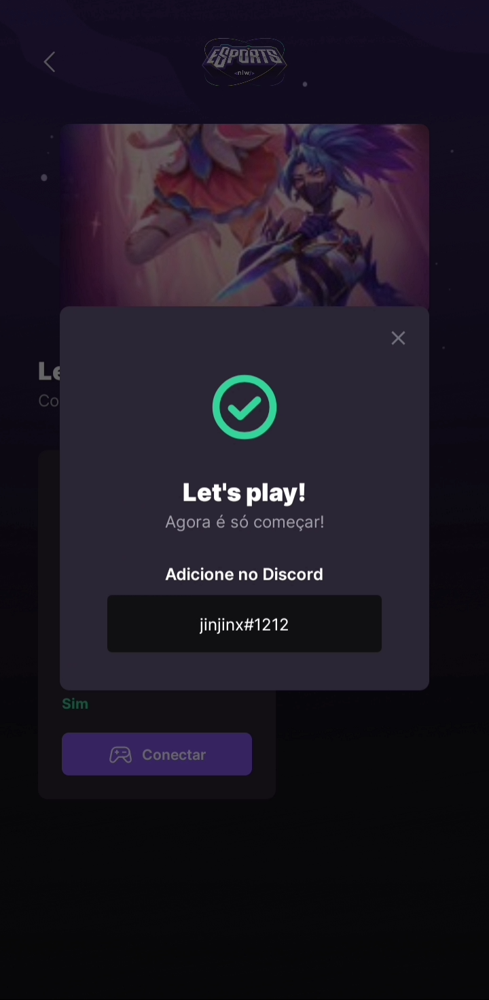
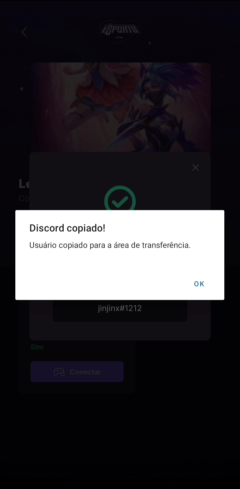

<h1 align="center">
    
</h1>

## 💻 Sobre o projeto

Aplicação com a finalidade de conectar pessoas para jogarem juntas.

Foi desenvolvido durante a NLW eSports da Rocketseat.

---

## ⚙️ Funcionalidades

- Criar anúncio de jogos.
- Ver anúncios criados.
- Adicionar usuário no Discord.

Para o desenvolvimento foram aplicados conceitos como:
- API connection
- Routes
- Typescript

---

## 🎨 Layout

### Web (Desktop)

  

  

### Mobile

  

  

  

  

---

## 🛠 Tecnologias
Principais ferramentas que foram usadas na construção do projeto:

#### **Backend**  [Node.js](https://nodejs.org/en)

-   **[Express](https://www.npmjs.com/package/express)**
-   **[Prisma](https://www.prisma.io/)**

#### **Mobile**  [Expo](https://expo.dev/)

-   **[Expo Clipboard](https://docs.expo.dev/versions/latest/sdk/clipboard/)**
-   **[Expo Notifications](https://docs.expo.dev/versions/latest/sdk/notifications/)**

#### **Web**  [Vite](https://vitejs.dev/)

-   **[Axios](https://www.npmjs.com/package/axios)**
-   **[Radix-ui - React Checkbox](https://www.radix-ui.com/docs/primitives/components/checkbox)**
-   **[Radix-ui - React Dialog](https://www.radix-ui.com/docs/primitives/components/dialog)**
-   **[Radix-ui - React Toggle Group](https://www.radix-ui.com/docs/primitives/components/toggle-group)**

---

## 🦸 Autor

  
 <b>Everton Schultz</b></a>
  

